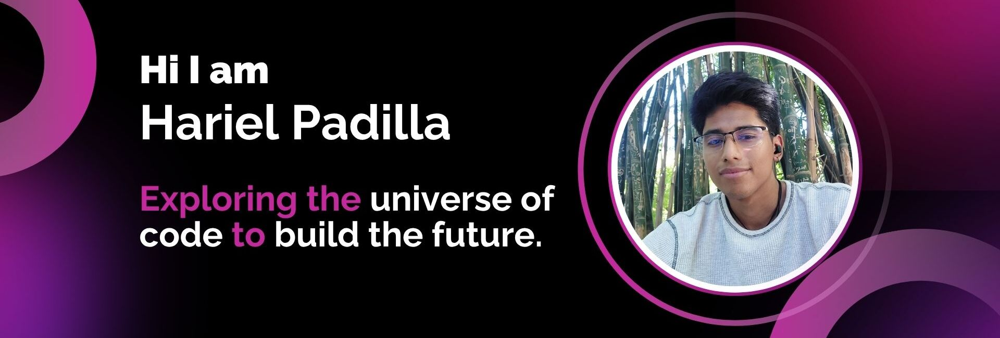

## 👋 Hi, I'm Hariel Padilla!
I'm an Artificial Intelligence Engineering student at [ESCOM-IPN](https://www.escom.ipn.mx/) with a strong interest in machine learning, deep learning, and neural networks. I’ve worked on projects that combine AI with real-world applications, using web technologies as tools (though I'm always eager to explore new frameworks and approaches).  

Passionate about learning, I focus on solving problems through intelligent systems and building meaningful projects beyond academic settings.

## 🌐 Redes y Contacto :
  
  
  

   

### Tools

  

# 📊 GitHub Stats:
 
 

---

